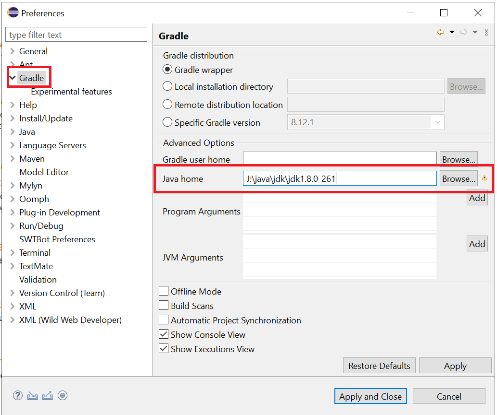
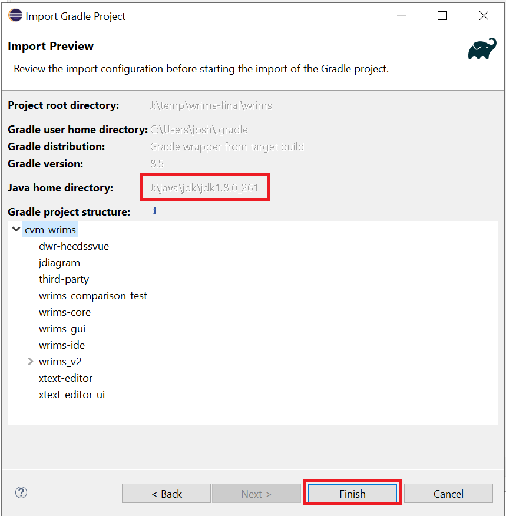
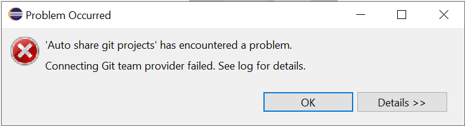
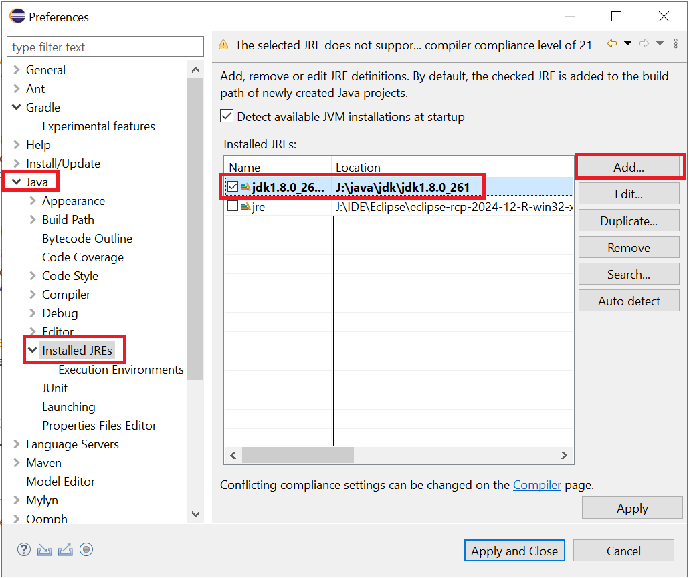
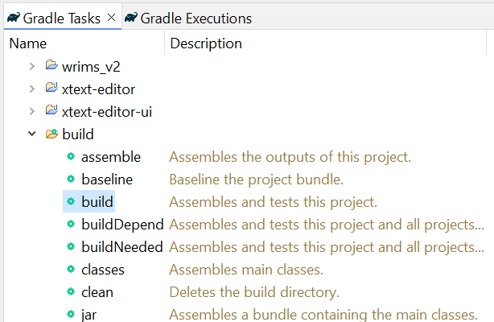
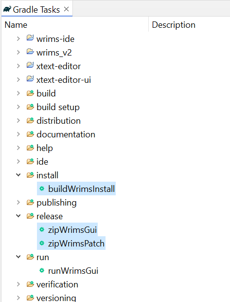
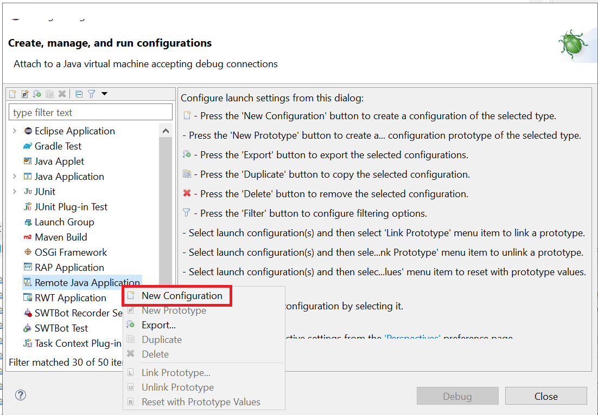

# Building WRIMS v2.x from this repository
The devops migration of WRIMS from native Eclipse to Gradle has allowed the WRIMS application to 
be built headlessly through github and streamlines the configuration of a developer build environment.

## WRIMS 2.2.x Gradle Structure
The Gradle integration involved refactoring the primary modules into the these root folders:
1. wrims-core: Compute Engine source
2. third-party: Collection of all third-party/external jars
3. wrims-ide: WRIMS Plugin source
4. dwr-hecdssvue: HEC-DSSVue Plugin source
5. jdiagram: Schematic View source
6. xtext: xtext processor source
7. xtext-ui: xtext editor source
8. wrims-gui: module used to assemble the WRIMS GUI application and Patch installers. 

# WRIMS Developer Build Setup - Using Gradle:
PREREQUISITES:
- Java 8
- Gradle 8.5
- Git
- IDE Eclipse
  - Latest Eclipse RCP download site:
  - https://www.eclipse.org/downloads/packages/release/2024-12/r/eclipse-ide-rcp-and-rap-developers
- \<USER-DIR\>\\.gradle\Gradle.properties configured with token for access to the CentralValleyModeling GitHub repository
```
...
cvmUserId=<userId>
cvmPassword=<userToken>
...
``` 

## 1. Pull Source from GitHub & build the project
Clone the repository to your local machine.
Repository Clone URL: https://github.com/CentralValleyModeling/wrims.git
Checkout the "Feature/wrims-devops" branch.
CD into the wrims directory
Build the project with gradle
Generate the Eclipse project files with gradle
```
git clone https://github.com/CentralValleyModeling/wrims.git
git switch Feature/wrims-devops
cd wrims
gradlew.bat build
gradlew.bat eclipse
```

## 2. Open Eclipse with a new/clean workspace

## 3. Import the wrims project into Eclipse
Once the Eclipse IDE is loaded, go to File-> Import... and select Import as an Existing Gradle Project


Select the wrims project directory and click next.


In the import menu, make sure to click on "Configure workspace settings" 


Set the JAVA HOME to an appropriate JDK (1.8) and click "Apply and Close"



Complete the import with default settings.



Note: Click OK on this error window if it appears:



## 4. Close extra projects
Close the following projects in the Eclipse workspace using right click menu action:
- wrims_v2
- wrims-comparison-test
 


## 5. Configure Eclipse JRE
Go to Window->Preferences->Java->Installed JRES
Add and select the same Java 1.8 version that was set as the JAVA HOME



Adjust the >Java>Compiler>Errors/Warnings for the "Depricated and restricted API">"Forbidden reference (access rules)" to "Warning"


## 6. Adjust the build version number 

The version number is configured to default to the branch name to support automatic tagged version
via the github actions build system. 

Edit the root build.gradle file and set an explicit version number.

Example:
```
//    version = versionLabel(versionDetails())
version = "20250101"
```
> [!NOTE]
> Any numerical value with up to 4 period-delimited values can be used as the version number.
> It does not need to match any existing tag or branch name. 
> (e.g. 20250101, 2.2.0, 2.2.0.1)

## 7. Build WRIMS with Gradle task
From the "Gradle Tasks" window, run the "build" task on the root project.

NOTE: This will not build an installer, only the code.



## 8. Building / Running the WRIMS Installer with Gradle Tasks

The following gradle tasks have been added to build/run the gradle installer:

- installer
  - buildWrimsInstall: Builds the WRIMS GUI installer (but does not create a zip)
- run
  - runWrimsGui: Runs the WRIMS GUI application (the WRIMS install must be built first)
- debug
  - debugWrimsGui: Runs the WRIMS GUI application in remote debug mode
- release
  - zipWrimsInstall: Builds the WRIMS GUI installer and creates a zip file
  - zipWrimsPatch: Builds the WRIMS patch zip file



> [!WARNING]
> If the buildWrimsInstall task fails with a 401 error like this: <br><br>
>   Could not GET 'https://maven.pkg.github.com/CentralValleyModeling/wrims/gov/ca/dwr/run-libs/maven-metadata.xml'. 
>   Received status code 401 from server: Unauthorized <br><br>
> You are likely missing the cvmUserId and cvmPassword prerequisite settings in your Gradle.properties file

## 9. Remote Debug the WRIMS GUI Application

After the WRIMS source has been configured and the installer has been build, you are ready to remote debug WRIMS.

### Configure the Remote Debug sessions:
From the toolbar, click Run>Debug Configurations

Create a new "Remote Java Application" configuration



Set the connection port to 5005


Add all the projects to the source tab


Apply and close the configuration. 

Launch WRIMS in debug mode using the debug > "debugWrimsGui" gradle task.

Open the Debug perspective in Eclipse.

Start the Remote Debug configuration.

You can now set breakpoints in the WRIMS GUI code and debug the application.

